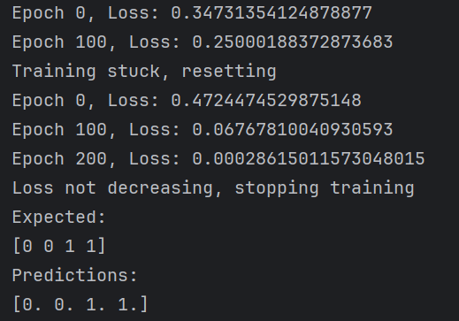

# NAVY - VOL0150
### Cvičení 1 - Perceptron

### Cvičení 2 - XOR problém

### Cvičení 3 - Hopfieldova síť

### Cvičení 4 - Q-Learning

#### Vizualizace Q-table

### Cvičení 6 - L-Systémy

### Cvičení 7 - IFS Fraktály

### Cvičení 8 - Mandelbrot set
#### Konečný zoom - 3,750,894,217,747,962x
#### Poslední frame trval vyrenderovat 25 minut
#### Ke konci už nestačil počet iterací, ale přesnost byla ještě dostatečná
 - Přes 10 MB
